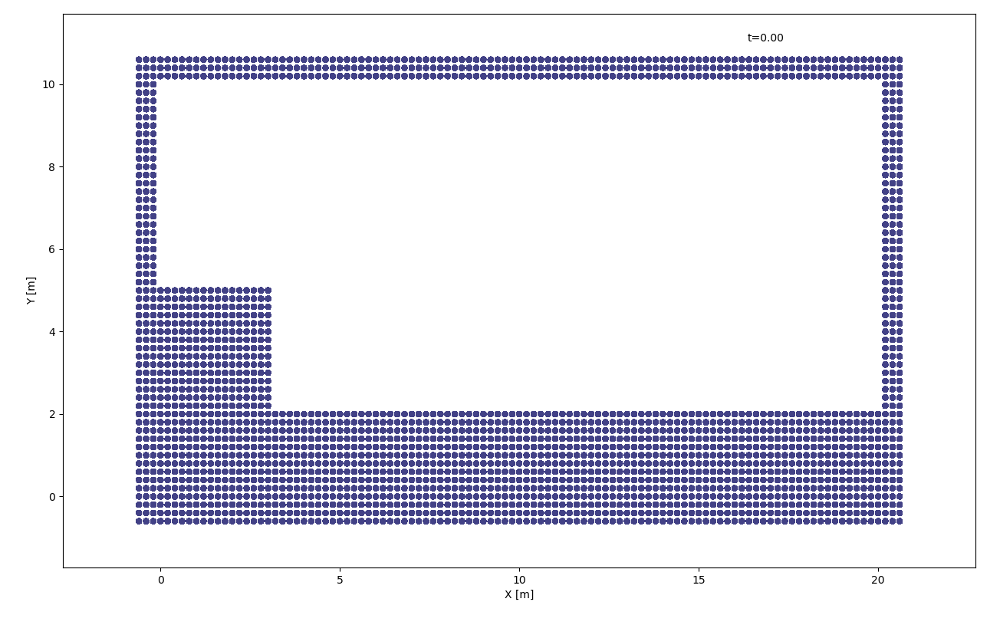

Smoothed Particle Hydrodynamics Simulator
===========================================
Creators: Richard Boyne, Deborah Pelacani Cruz, Deirdrée Polak, Tayfun Karaderi, Yusef Falola

This software is designed to simulate a 2D fluid flow system using a space and time discretisation of the Navier-Stokes and conservation of momentum equations. System boundaries are implemented using the Lennard-Jones Potential for repulsion to prevent particles from leaking. Timestepping is adaptive to guarantee CFL stability.

Please, read License agreement prior using.

## Installation
The software should be used as python modules in your local folder. In your python project import the modules as:
      
```python
import sph_fe as sphfe
import sph_ie as sphie
import sph_ap as sphap
```

## Requirements
To be able to run this software, the following packages and versions are required:

- numpy >= 1.15.4
- scipy >= 1.1.0
- matplotlib >= 3.0.2
- mpltools >= 0.2.0
- sympy >= 1.3
- pandas >= 0.23.4

## Documentation
**add documentation here**


## Usage
The three modules provide different methods and adaptations to timestepping the Navier-Stokes equations. 
- sph_fe: provides a forward euler timestepping, with Lennard-Jones boundary repulsion (optimised)
- sph_ie: provides an improved predictor-corrector timestepping method with Lennard-Jones boundary repulsion
- sph_ap: provides the same predictor-corrector timestepping method, with Lennard-Jones boundary repulsion and inserted artificial pressure to prevent tensile instability.

The simulation can be easily run using the sph_simulation function, common amongst all modules. The simulator requires the user to specifcy a minimum and maximum coordinate (in meters) of the system domain, a time frame (in seconds) and a function that specifies the initial position of particles of the domain with a boolean output. Other parameters are optional and if not specified will be used as the default setting (refer to docstring).

### Example 1
```python    
def f(x, y):
        if 0 <= y <= 2 or (0 <= x <= 3 and 0 <= y <= 5):
            return 1
        else:
            return 0

sphfe.sph_simulation(x_min=[0, 0], x_max=[20, 10], t_final=10, dx=0.2, func=f, path_name='./examples/',
                     ani_step=10, ani_key="Pressure", file_name="example33")
```
The function *f* will produce the following initial condition:



and the simulation will produce a .csv file at the specified path name and file name containing information about each particle at each timestep in the following format:


Unless the optional parameter *ani* is set to False, the simulator function will also produce an animation of the dynamic system over the timeframe. The parameter *ani_key* will let you choose between what parameters should be plotted in the colorplot besides position of the particles. Choices are: Pressure, Density, V_y and V_x. Parameter *ani_step* allows for quicker plotting by skipping some of the timestepping frames.

### Example 2
If a file with the format above already exists, a simulation can be animated simply by setting up and calling the animation function
```python
ani = sphfe.load_and_set('./examples/example33.csv', 'Density')
ani.sphfe.animate(ani_step=10)
plt.show()

```
    
    
              
```
